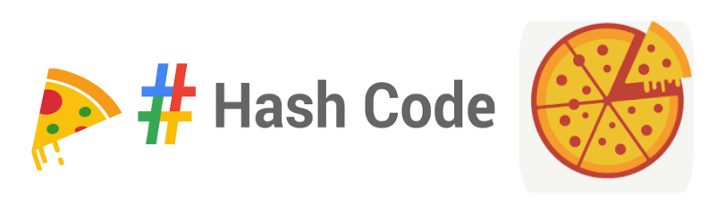

# Google Hash Code 2020

## What is Hash Code?

Google’s team-based programming competition, Hash Code, allows you to share your skills and connect with other coders as you work together to solve a problem modeled off a real Google engineering challenge! In small teams of two to four, coders all over the world will tackle the first problem through an Online Qualification Round. Though this round is hosted online, teams can come together to compete side-by-side in locally coordinated Hash Code hubs. The top teams from this round are invited to join us at an international Google office for our annual Hash Code Final Round.

## How it works

Once you’ve registered for the contest, you’ll gain access to our Judge System. The Judge System is our online platform where you’ll form your team, join a hub, practice, and compete during the rounds. During the Online Qualification Round, you’ll watch our YouTube livestream to be introduced to the problem, and your team will have four hours to solve an optimization problem using the programming language and tools of your choice. Teams can compete from a local hub or another location of their choice. The top teams from the Online Qualification Round will be invited to the Final Round at a Google office, where they’ll work together to solve another challenge and compete for cash prizes.
